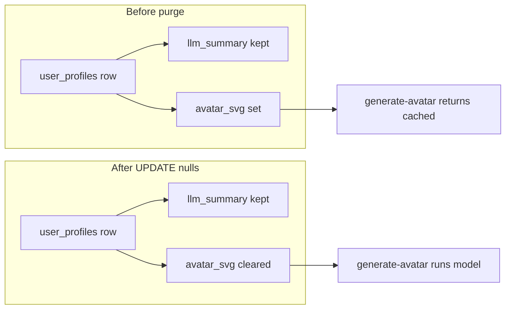

# Purge stored avatars to force regeneration

## How storage and idempotency work

- **Database:** [analytics.user_profiles](migrations/002_add_user_profiles.cql) in Cosmos DB for Cassandra (same CQL as [src/analytics.rs](src/analytics.rs): keyspace `analytics`, table `user_profiles`).
- **Fingerprint mapping:** The client canvas hash is stored as `**session_id`** (see comments in migrations and `upsert_persona_avatar` in [src/analytics.rs](src/analytics.rs)).
- **Why a purge is needed:** [user_profile_generate_avatar](src/api.rs) returns the existing SVG without calling the model when `existing.avatar_svg` is non-empty (idempotent cache). Regeneration only runs when `avatar_svg` is empty (see lines 256–267).
- **Summaries preserved:** You chose to keep `**llm_summary`**. Only clear `**avatar_svg`** and `**persona_guess**`; do not `TRUNCATE` the table (that would wipe summaries).

## DALL-E vs current code

- Today, “art” is **Anthropic-generated inline SVG** ([src/avatar.rs](src/avatar.rs)), not DALL-E. The purge procedure is identical if you later switch generators: empty avatar columns force a new generation path.

## CQL to run (per row or scripted)

Clear avatar fields for one fingerprint:

```sql
UPDATE analytics.user_profiles
SET avatar_svg = null, persona_guess = null
WHERE session_id = '<paste-fingerprint>';
```

In Cassandra/CQL, `null` removes those column values; the Rust reader treats missing avatar as empty ([get_user_profile](src/analytics.rs)), which satisfies the “no cache” branch in the API.

## Bulk purge (all visitors)

Cassandra/Cosmos Cassandra does not offer a single `UPDATE` without a partition key. You must **enumerate `session_id` values** and run an `UPDATE` per key (or batch statements with bounded batch sizes):

1. **Connect** with `cqlsh` using the same contact point, port `10350`, and credentials as production `blog-service` / [setup_analytics](src/bin/setup_analytics.rs) (or Azure Data Explorer for Cassandra if that is your standard).
2. **List keys** (adjust if your cluster requires `ALLOW FILTERING` for a full scan — acceptable for a small `user_profiles` table; for very large tables, prefer a one-off tool with paging/rate limits):
  `SELECT session_id FROM analytics.user_profiles;`
3. **For each `session_id`**, run the `UPDATE` above (script in shell, Python, or a small Rust program reusing the same `Session` as the service).

**Do not** use `TRUNCATE analytics.user_profiles` for this goal — it removes `llm_summary` rows entirely.

## Verify after purge

- `GET /user-profile?fingerprint=...` should show `"avatar_svg": null` (or empty, depending on JSON serialization of missing cells).
- Next visit to `/who-are-you` or home avatar flow calls `POST /api/analytics/generate-avatar` → Rust `POST /user-profile/generate-avatar` → should return `"cached": false` once and store new SVG.

## Addendum — regional collage (OpenAI PNG) only

If production uses **`avatar_png`** + daily/session cache (collage path) and **no longer writes `avatar_svg`**, force regeneration by clearing the PNG and cache columns your schema uses, for example:

- `UPDATE analytics.user_profiles SET avatar_png = null, persona_guess = null, avatar_session_id = null WHERE session_id = ?` — exact column names must match [`migrations/`](migrations/) and [`src/analytics.rs`](src/analytics.rs) on the branch you deploy.

See [captcha-regional-collage-avatar_863e66df.plan.md](captcha-regional-collage-avatar_863e66df.plan.md) for the active implementation plan.

## Optional hardening (out of scope unless you want it)

- Add a **protected admin route or CLI** in `blog-service` to “invalidate avatars” (UPDATE by `session_id` or full scan) so this does not require raw CQL next time.




